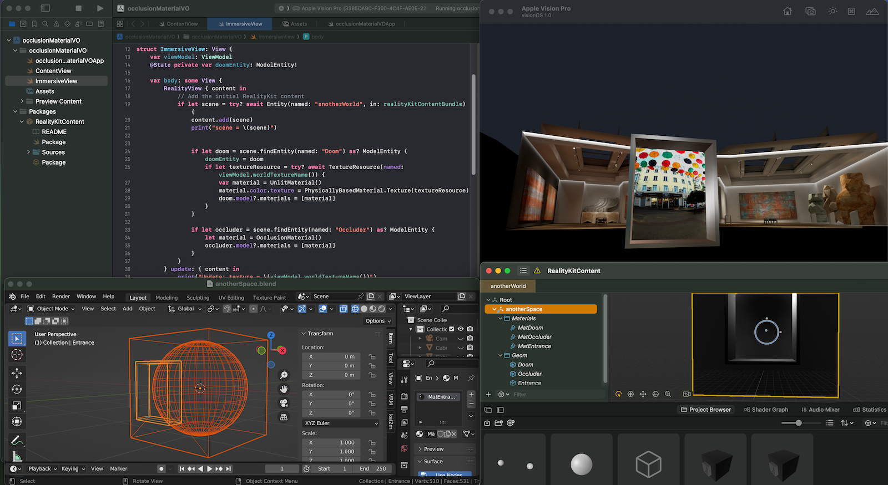
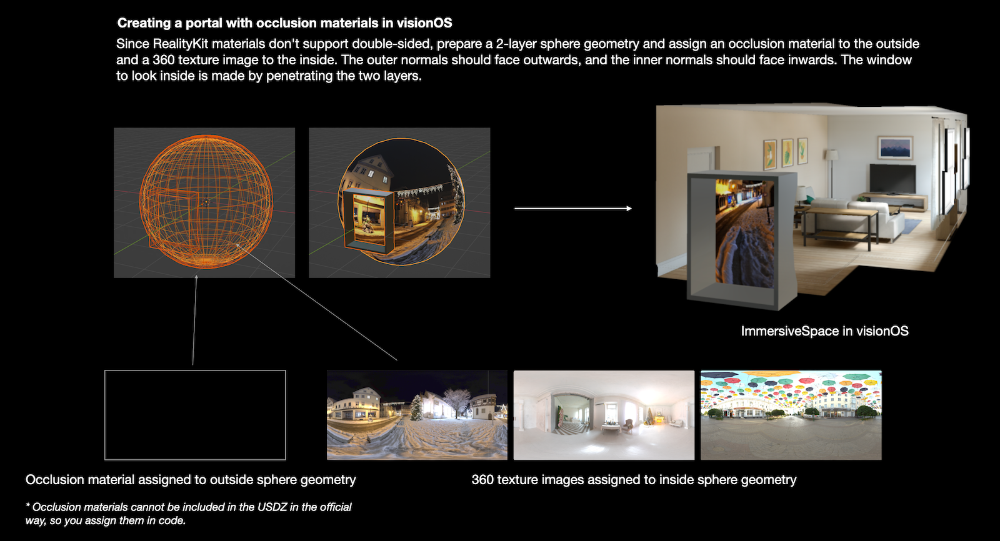

# Portal Space with an Occlusion Material in visionOS

Very simple AR app in visionOS, that shows portal spaces with an occlusion material.

- Build: Xcode 15 beta 6 (Beta 6 is required for some issues of beta 3-5), macOS 14 beta
- Target: visionOS 1.0 beta (You can run the app with the Vision Pro simulator of Xcode 15.)

*Since this project is based on the beta software, this repository is temporal and will be deleted after a while.*

Creating a portal with occlusion materials in visionOS

- Since RealityKit materials don't support double-sided, prepare a 2-layer sphere geometry and assign an occlusion material to the outside and a 360 texture image to the inside. The outer normals should face outwards, and the inner normals should face inwards. The window to look inside is made by penetrating the two layers.
- Occlusion materials cannot be included in the USDZ in the official way, so you assign them in code.

## Assets

Some HDRI textures are bundled. Thank you for sharing great HDRI textures.

- Sergej Majboroda: https://polyhaven.com/all?a=Sergej%20Majboroda
- Greg Zaal: https://polyhaven.com/all?a=Greg%20Zaal

## References

- Related iOS project: ARSimplePortal (https://github.com/ynagatomo/ARSimplePortal)

## License

